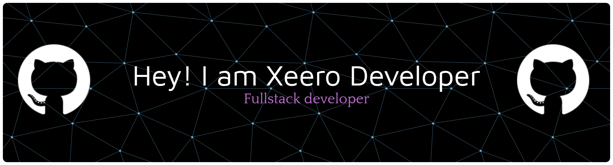

<h1 align="center">Hi 👋, I'm Moh. Zainur Rozy</h1>
<h3 align="center">Fullstack Developer • Website Developer • Laravel Developer • Open Source Enthusiast</h3>

---

## 🌐 Socials

 

# 💻 Tech Stack

 

 

## 📊 GitHub Stats

  

### ✍️ Random Dev Quote

 

## 🐍 Contribution Snake

  <picture>
    <source media="(prefers-color-scheme: dark)"
      srcset="https://raw.githubusercontent.com/Xeerodev/myprofilegithub/snake-output/github-contribution-grid-snake-dark.svg">
    <source media="(prefers-color-scheme: light)"
      srcset="https://raw.githubusercontent.com/Xeerodev/myprofilegithub/snake-output/github-contribution-grid-snake.svg">
    
  </picture>

## 🌼 Contribution Pacman

<picture>
  <source media="(prefers-color-scheme: dark)"
          srcset="https://raw.githubusercontent.com/Xeerodev/myprofilegithub/pacman-output/pacman-contribution-graph-dark.svg?game=pacman">
  <source media="(prefers-color-scheme: light)"
          srcset="https://raw.githubusercontent.com/Xeerodev/myprofilegithub/pacman-output/pacman-contribution-graph.svg?game=pacman">
  
</picture>

## 📈 Contribution Graph

  

<h3 align="center">
⭐ Thanks for visiting my profile ⭐
</h3>
